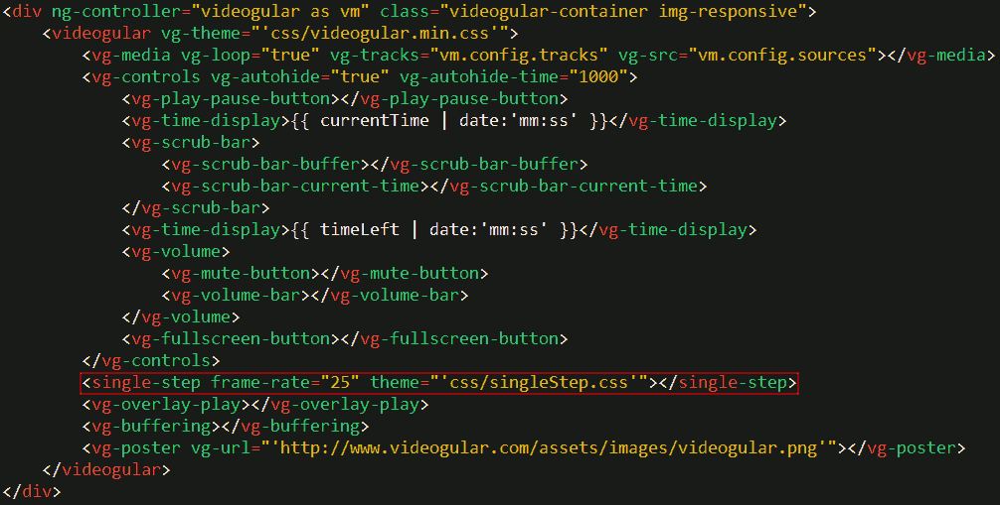

# v2-Videogular-SingleStep
Videogular Plugin to single step frame by frame in a video. Forward and backwards.

# Known Bug
The video will go 1 frame backward when pausing if using a video that's not 20fps

# Setup

add singleStep tag inside videogular:

and add this following in the controller:

Notice the 2 attributes.

- frameRate : the fps of the video
- theme : the css file of single step

