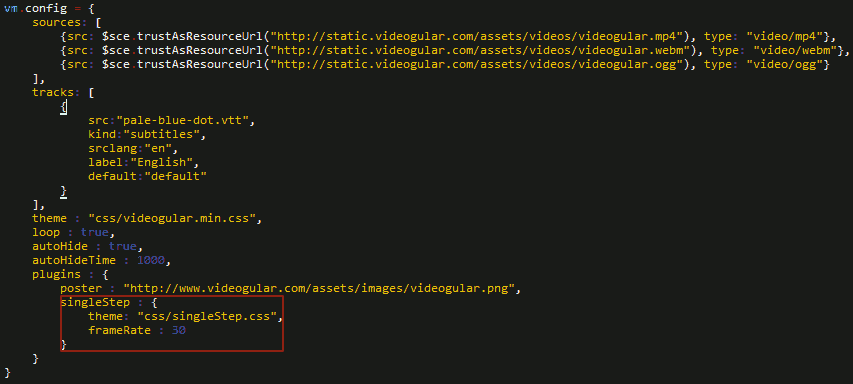

# v2-Videogular-SingleStep
Videogular Plugin to single step a video, frame by frame. Forwards and backwards.

# Known Issues
The video will go 1 frame backward when pausing if using a video that's not 20fps.

# Setup

## Step1: Add singleStep tag inside videogular:

## Step 2: Add this following in the controller:

## Notice the 2 properties.

1. frameRate : the fps of the video
2. theme : the css file of SingleStep

Both properties are required.

# Reference
## How to check the fps of a video

1. right-clicking it and click on properties
2. go to the Details tab
3. scroll to the video section and you can see the frame rate property
